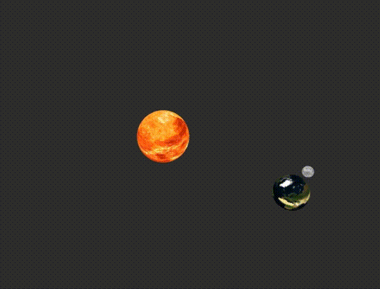

# WebGL playground

[](https://opensource.org/licenses/MIT)

## Links and Notes
- [WebGL Fundamentals. Lessons](https://webglfundamentals.org/webgl/lessons/)
- [gl-matrix](http://glmatrix.net/)
- [twgl.js](https://twgljs.org/)
- [learnopengl.com](https://learnopengl.com/)

## Learn, Practice and POC

### Cubemap Texture and SkyBox
 - [WebGL2 SkyBox](https://webgl2fundamentals.org/webgl/lessons/webgl-skybox.html)
 - [WebGL2 Cubemaps](https://webgl2fundamentals.org/webgl/lessons/webgl-cube-maps.html)


- `src/skybox.ts`
- `src/cubemap.ts`

### 08_ready_for_scene_graph.ts
Add some Node and SceneNode class prototypes. Goal is to create Screen Tree structure to apply transformation to group of obejct hierarchically.
Beneath the Node and ScreenNode please see the simple render code which are ready to further decomposition.



## Installation

```bash
yarn install
```

## Usage

### Development server

```bash
yarn start
```


## License

This project is open source and available under the [MIT License](LICENSE).
